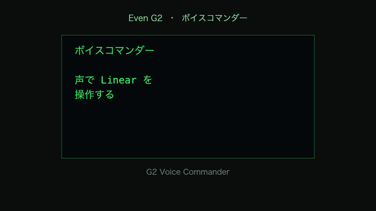

# G2 Voice Commander

Turn your [Even Realities G2](https://www.evenrealities.com/) smart glasses into a
**hands-free voice commander for your own workflow.** Speak a thought — it becomes a
structured [Linear](https://linear.app) issue, a PRD, or a comment on an existing issue,
and the glasses show you the result. No phone, no screen, no hands.

> The killer app for smart glasses might be **going all-in on private/personal use** —
> ambient, glanceable, hands-free augmentation of *your* work. This is that bet.

A series of small, self-contained Even G2 (Even Hub) plugins built with
**Even Hub SDK + TypeScript**, each a step toward an ambient *agentic dev cockpit*.



> Tap → speak → Gemini classifies the intent → it lands as a Linear **Issue**, a **PRD**,
> or a **comment** on an existing issue. (Green dot-art is the actual G2 monochrome display.)

## Apps

| App | What it does | Status |
| --- | --- | --- |
| [`apps/voice-commander`](apps/voice-commander) | Tap → speak → Gemini turns it into a Linear **Issue / PRD / comment** → glasses show `✓ KEN-123` | ✅ device-verified MVP |

_(more in the series to come)_

## The vision — an ambient agentic dev loop

The glasses as the **voice-in / status-out** surface for orchestrating AI agents on your work:

1. **Issue作成** — speak a thought → Linear issue. *(shipped)*
2. **AI commands** — “make a PRD”, “summarize requirements”, route by spoken intent. *(shipped)*
3. **Claude Code link** — hand off an issue # → implementation starts → progress on the glasses.
4. **Two-way notifications** — “done”, “review pending”, “CI failed”, “PR created” pushed to the HUD.
5. **Multi-agent** — ChatGPT (sparring) · Claude Code (build) · Linear (tasks) · GitHub (PRs) · G2 (UI).

Architecture note: stages 1–2 are **client-only** (glasses → SaaS APIs directly). Stage 3+
adds a small orchestrator and uses **Linear/GitHub as the shared event bus** — agents write
status there, the glasses read it.

## Run it

**Provider keys live in a Cloudflare Worker proxy ([`proxy/`](proxy)), never in the app.** The
glasses app ships zero secrets and talks to the proxy with a lightweight token — so the
`.ehpk` is safe to install as a persistent private app.

### 1. Deploy the proxy

```bash
cd proxy
npm install
npx wrangler login
npx wrangler secret put GEMINI_API_KEY     # https://aistudio.google.com
npx wrangler secret put LINEAR_API_KEY     # Linear → Settings → Security & access → Personal API keys (write)
npx wrangler secret put LINEAR_TEAM_ID     # your Linear team UUID
npx wrangler secret put APP_TOKEN          # any random string; the app sends it as a bearer token
npx wrangler deploy                        # → https://g2-voice-commander-proxy.<you>.workers.dev
```

(Local dev: copy `.dev.vars.example` → `.dev.vars`, fill it, `npm run dev`.)

### 2. Point the app at the proxy and run

```bash
cd apps/voice-commander
cp .env.example .env        # set VITE_PROXY_URL to your Worker URL, VITE_APP_TOKEN to the same token
npm install
npm run dev                 # serves on your LAN (host:true)
```

Open the dev URL on your **LAN IP** and scan the on-screen QR in the Even Realities app →
Developer Center. For a persistent install, `npm run build` → `npx evenhub pack app.json ./dist`
→ install the `.ehpk` — it contains **no secrets**, so this is safe.

## Safety

- The app ships **no provider keys**. They live only as Cloudflare Worker secrets.
- `.env`, `.dev.vars`, `dist/`, and `*.ehpk` are git-ignored. **Never commit them.**
- `VITE_APP_TOKEN` is just a gate on your proxy — rotate it if it leaks; your provider keys stay safe.

## License

[MIT](LICENSE) © Ken Narita
